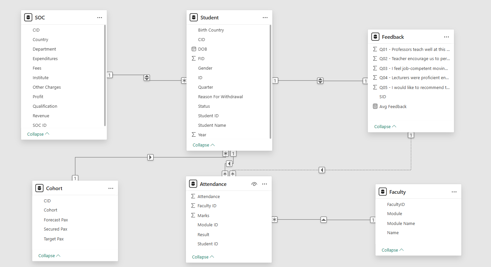
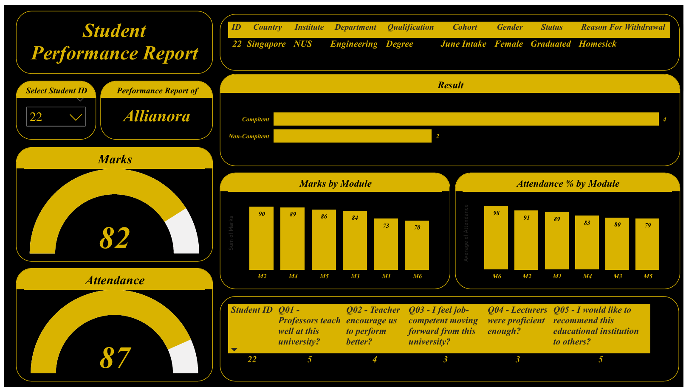
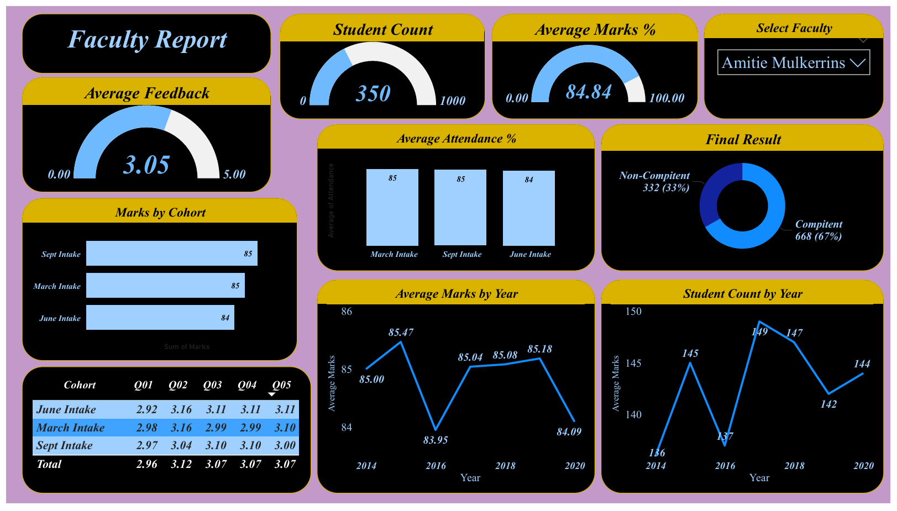
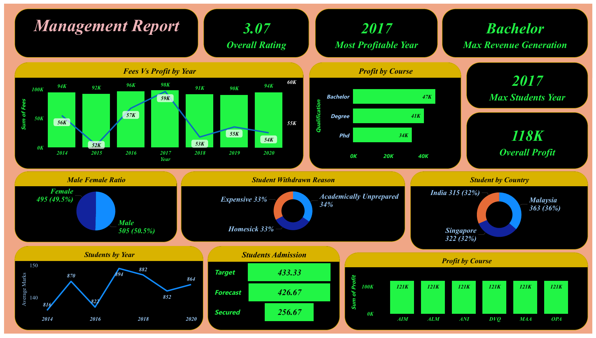

# University Analytics Dashboard (Power BI)

## Project Objective
The objective of this project is to perform a detailed analysis of university data using **Power BI**.  
It leverages **data modeling and interactive visualizations** to monitor student performance, faculty effectiveness, and institutional financial health.

---

# Project Description
This repository contains a comprehensive academic analytics environment that simulates a university ecosystem.

The project explores multiple aspects of university operations including:

- Student demographics
- Module-wise academic performance
- Faculty teaching effectiveness
- Enrollment and cohort analysis
- Institutional financial insights

The dashboard provides **data-driven indicators that can support decision-making and institutional optimization**.

---

# Tools & Technologies

The following stack was used to build this end-to-end analytics solution:

| Tool | Purpose |
|-----|------|
| **Power BI** | Dashboard development and visualization |
| **Excel** | Dataset creation and relational storage |
| **DAX** | Analytical measures and calculations |
| **Power Query** | Data cleaning and transformation |
| **GitHub** | Project version control and documentation |

---

# Dataset Description

The source data is stored in:

Project.xlsx

The dataset consists of **6 relational tables**:

### 1️. SOC Table
Mapping of students to academic structures.

Includes fields such as:

- Cohort ID
- SOC ID
- Revenue
- Country
- Institute
- Department
- Qualification
- Fees
- Other Charges
- Expenditures
- Profit

---

### 2️. Student Table
Contains student demographic and academic information.

Key attributes include:

- Student Name
- Gender
- Birth Country
- SOC ID
- Faculty ID
- Student ID
- Date of Birth
- Status
- Reason for Withdrawal
- Year
- Quarter
- Cohort ID

---

### 3️. Attendance Table
Contains performance metrics.

Key metrics include:

- Marks
- Attendance %
- Module ID
- Student ID
- Faculty ID
- Result

---

### 4️. Faculty Table
Contains faculty information and assigned modules.

Fields include:

- Faculty ID
- Faculty Name
- Module
- Module Name

---

### 5️. Feedback Table
Contains student feedback responses regarding teaching quality.

Questions include:

- Q01 Professors teach well at this university?
- Q02 Teacher encourage us to perform better?
- Q03 I feel job-competent moving forward from this university?
- Q04 Lecturers were proficient enough?
- Q05 I would like to recommend this educational institution to others?

---

### 6️. Cohort Table
Tracks admission intake performance.

Fields include:

- Cohort
- Target Pax
- Forecast Pax
- Secured Pax
- Cohort ID

---

# Data Model Architecture

The dataset follows a **fact-dimension relational structure** designed for analytical reporting.

### Fact Table

Attendance

Contains measurable metrics such as:

- Marks
- Attendance %

---

### Dimension Tables

- Student  
- SOC  
- Faculty  
- Cohort  
- Feedback  

These tables provide descriptive attributes that allow analysis across **students, faculties, cohorts, departments, and academic years**.

### Table Relationships

Cohort (1) → SOC ()
SOC (1) → Student ()
Student (1) → Attendance ()
Faculty (1) → Attendance ()
Student (1) ↔ Feedback (1)

### Data Model Diagram

---

# Dashboard Reports

This project contains **three interactive Power BI dashboards**.

---

## Student Performance Dashboard

Focuses on **individual student performance analysis**.

Key metrics include:

- Student marks
- Attendance percentage
- Competency status
- Module-wise marks distribution
- Module-wise attendance
- Student feedback scores

---

## Faculty Performance Dashboard

Evaluates **faculty teaching effectiveness**.

Metrics include:

- Student count per faculty
- Average marks achieved
- Average attendance percentage
- Competency results
- Feedback scores by cohort
- Year-wise performance trends

---

## Management Dashboard

Provides **institution-level insights for strategic decision-making**.

Key indicators include:

- Fees vs Profit trend
- Most profitable year
- Revenue by qualification
- Student distribution by country
- Gender ratio
- Student withdrawal reasons
- Admission targets vs secured enrollments

---

# Key Insights

Some major insights derived from the dashboard include:

- **Bachelor programs generate the highest revenue**
- **2017 was identified as the most profitable year**
- Student population is **almost evenly distributed between male and female**
- Major withdrawal reasons include **homesickness, financial challenges, and academic preparation**
- Student enrollment is distributed across **India, Singapore, and Malaysia**
- Higher **attendance levels correlate with better student marks**

---

# Repository Structure

University-Analytics-PowerBI
│
├── Project.pbix
├── Project.xlsx
├── Project.pdf
├── Data Model.png
├── Student Report.png
├── Faculty Report.png
├── Management Report.png
└── README.md

---

# How to Use

### 1️. Clone the repository

git clone https://github.com/HarshRaj57820/University-Analytics-PowerBI

### 2️. Open the Power BI file

Open:

Project.pbix

in **Power BI Desktop**.

### 3️. Load the dataset

Ensure the file path to:

Project.xlsx

is correctly mapped in **Power Query** if prompted.

---

# Future Improvements

Potential enhancements for this project include:

- Student dropout prediction using Machine Learning
- Enrollment forecasting models
- Real-time data pipeline integration
- Advanced cohort analytics

---

# Author

**Harsh Raj**

Aspiring **Data Analyst | Power BI Developer**

GitHub Profile:  
https://github.com/HarshRaj57820
